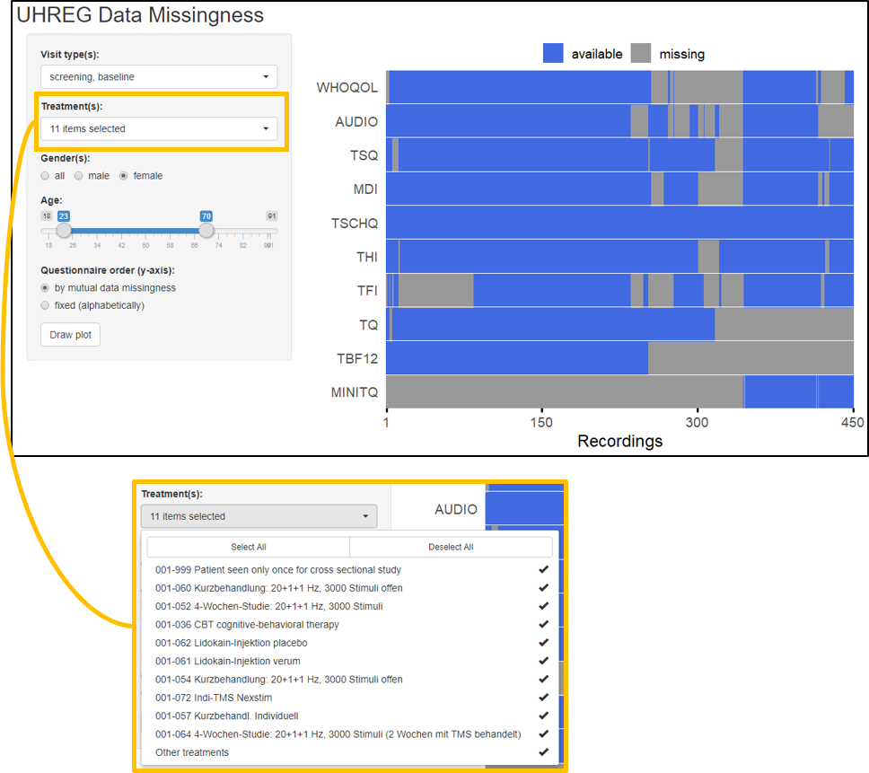

# uhregmisc

Miscellaneous Helper Functions For The Univ. Regensburg Tinnitus Data.

**Important:** For most of the functions to work, you would need to put
into the `data-raw/` folder the original dataset (`200622_uhreg.xlsx`)
which cannot be uploaded to GitHub due to copyright reasons.

## Overview

  - `data-raw/uhreg.R`: preprocessing script for the raw UHREG data
  - datasets `uhreg` and `data_dict` (+ json export at
    `inst/extdata/data_dict.json`)
  - function `discretize_score()` for discretizing a numeric
    questionnaire score according to predefined cutoff values from
    literature.
  - Shiny app to explore missingness / available data.

## Installation

``` r
remotes::install_github("unmnn/uhregmisc")
```

``` r
library(uhregmisc)
```

## Shiny app on data missingness



Provides an overview of missing data patterns. You can specify a data
subset based on:

  - visit type: screening, baseline, interim visit, final visit and/or
    followup
  - treatment (10 most frequent treatment types are selectable)
  - gender
  - age range

Additionally, you can choose to order questionnaires (y-axis) either by
mutual missingness (determined by a hierarchical clustering) or just
alphabetically by their name.

### How to run app

``` r
# When running the first time, create the necessary pre-processed dataset with:
source("app-ume/ume_prep-data.R")
# Afterwards, the folder `app-ume` should contain the file `data.rds`.
# Then, just run the app via:
shiny::runApp("app-ume")
```

## Data preprocessing steps

The script `data-raw/uhreg.R` preprocesses the UHREG data.

  - part of column name representing the questionnaire is written in
    caps
  - establish consistent name convention: prefix of variable name (part
    until first underscore) represents the name of the corresponding
    questionnaire
      - example: `TQ_q01` → `TQ` questionnaire
      - meta variables, e.g. patient ID or treatment type, have the
        prefix `.META`
  - some variables are renamed for consistency of chronology,
    e.g. `TSCHQ_q36_1_otologic_additional` instead of
    `TSCHQ_q361_otologic_additional`
  - abbreviations in names: `q` instead of `question`, `lvs` instead of
    `last_validation_status`
      - example: `TBF12_q10` instead of `TBF12_question10`
  - in column names, zero-padding is added to allow for alphabetical
    ordering, e.g. `TBF12_q01` instead of `TBF12_q1` (there is also a
    `TBF12_q10`)
  - all BDI columns are removed due to complete missingness
  - variable types are converted where appropriate:
      - `TSCHQ_q02_sex` to `factor`
      - `.META_patient_id` to `character`
      - `.META_visit_day`, `TSCHQ_q05_begin_tinnitus` to `date`
  - `-1` values are replaced with `NA_integer_` where appropriate
  - some (sub-)scales are created:
      - TFI subscales: intrusive, sense of control, cognitive, sleep,
        auditory, relaxation, quality of life, emotional
      - TQ subscales: emotional distress, cognitive distress,
        intrusiveness, auditory perceptual difficulties, sleep
        disturbances, somatic complaints
      - MDI: depression categorization

## Open questions

<!-- - Why are there no data for the BDI questionnaire? -->

<!-- - What does the `position` column represent? -->

<!-- ``` -->

<!--    1    2    3 -->

<!-- 2010  187  102 -->

<!-- ``` -->

<!-- - What does the prefix "v_" mean in some column names, e.g. "v_tfi_question_1"? -->

  - How to deal with the huge variety of treatment pathways?

<!-- end list -->

    92 unique treatment pathways
    
                            S-B-I-I-I-FV                               S-B-FV                            S-B-FV-FU
                                      26                                   31                                   36
                                    B-FV                                    S
                                      44                                  790

  - Is there any documentation for the audiological assessment? There
    are a lot of negative values (e.g. -1 for AUDIO\_duration) and
    “repdigits” (999, 99999) - I assume they have a special meaning.
  - What do the columns with “last\_validation\_status” mean? What do
    their values (-1, 0, 1) mean?
  - Documentation for “v\_exp\_tschq\_q36\_otologic” and
    “v\_exp\_tschq\_q361\_otologic\_additional”

## TODOS

  - Improve rudimentary documentation for `uhreg` and `data_dict`
  - Add function that dummifies categorical variables

## `data_dict`

``` r
library(dplyr)
library(purrr)
data_dict
```

    ## # A tibble: 294 x 4
    ##    variable                     variable_original                              description    value     
    ##    <chr>                        <chr>                                          <chr>          <list>    
    ##  1 .META_patient_id             new_ID                                         Patient ID     <NULL>    
    ##  2 .META_treatment_code         treatment_code                                 Treatment code <chr [75]>
    ##  3 .META_visit_day              visit_day                                      Day of visit   <NULL>    
    ##  4 .META_visit_type             visit_type                                     Type of visit  <chr [5]> 
    ##  5 AUDIO_duration               audiological_examination_duration              <NA>           <NULL>    
    ##  6 AUDIO_left_frequency_loss_01 audiological_examination_left_frequency_loss_1 <NA>           <NULL>    
    ##  7 AUDIO_left_frequency_loss_02 audiological_examination_left_frequency_loss_2 <NA>           <NULL>    
    ##  8 AUDIO_left_frequency_loss_03 audiological_examination_left_frequency_loss_3 <NA>           <NULL>    
    ##  9 AUDIO_left_frequency_loss_04 audiological_examination_left_frequency_loss_4 <NA>           <NULL>    
    ## 10 AUDIO_left_frequency_loss_05 audiological_examination_left_frequency_loss_5 <NA>           <NULL>    
    ## # ... with 284 more rows

``` r
var <- "TSCHQ_q09_perception"
data_dict %>% filter(variable == var) %>% pull(description)
```

    ## [1] "Where do you perceive your tinnitus?"

``` r
data_dict %>% filter(variable == var) %>% pluck("value", 1)
```

    ##                          -1                           0                           1                           2                           3 
    ##            "no information"                 "right ear"                  "left ear"  "both ears, worse in left" "both ears, worse in right" 
    ##                           4                           5                           6 
    ##        "both ears, equally"           "inside the head"                 "elsewhere"

## `uhreg` overview

``` r
skimr::skim_without_charts(uhreg)
```

|                                                  |       |
| :----------------------------------------------- | :---- |
| Name                                             | uhreg |
| Number of rows                                   | 2299  |
| Number of columns                                | 295   |
| \_\_\_\_\_\_\_\_\_\_\_\_\_\_\_\_\_\_\_\_\_\_\_   |       |
| Column type frequency:                           |       |
| character                                        | 7     |
| Date                                             | 2     |
| factor                                           | 2     |
| numeric                                          | 284   |
| \_\_\_\_\_\_\_\_\_\_\_\_\_\_\_\_\_\_\_\_\_\_\_\_ |       |
| Group variables                                  | None  |

Data summary

**Variable type: character**

| skim\_variable                      | n\_missing | complete\_rate | min | max | empty | n\_unique | whitespace |
| :---------------------------------- | ---------: | -------------: | --: | --: | ----: | --------: | ---------: |
| .META\_patient\_id                  |          0 |           1.00 |   1 |   4 |     0 |      1111 |          0 |
| .META\_treatment\_code              |          0 |           1.00 |   7 |   7 |     0 |        25 |          0 |
| TSCHQ\_q04\_1\_family\_additional   |       2012 |           0.12 |   1 |   5 |     0 |         7 |          0 |
| TSCHQ\_q07\_begin\_correlation      |       1026 |           0.55 |   1 | 287 |     0 |       479 |          0 |
| TSCHQ\_q13\_tone\_perception        |        992 |           0.57 |   1 | 442 |     0 |       984 |          0 |
| TSCHQ\_q25\_medication              |       1909 |           0.17 |   3 | 364 |     0 |       314 |          0 |
| TSCHQ\_q36\_1\_otologic\_additional |       2298 |           0.00 |  37 |  37 |     0 |         1 |          0 |

**Variable type: Date**

| skim\_variable              | n\_missing | complete\_rate | min        | max        | median     | n\_unique |
| :-------------------------- | ---------: | -------------: | :--------- | :--------- | :--------- | --------: |
| .META\_visit\_day           |          0 |           1.00 | 2016-01-03 | 2020-05-28 | 2018-01-11 |       892 |
| TSCHQ\_q05\_begin\_tinnitus |       1187 |           0.48 | 1967-06-09 | 2019-11-01 | 2013-02-15 |       567 |

**Variable type: factor**

| skim\_variable     | n\_missing | complete\_rate | ordered | n\_unique | top\_counts                           |
| :----------------- | ---------: | -------------: | :------ | --------: | :------------------------------------ |
| .META\_visit\_type |          0 |           1.00 | FALSE   |         5 | S: 1095, FV: 380, B: 370, FU: 277     |
| MDI\_depression    |        582 |           0.75 | FALSE   |         4 | no : 1508, sev: 139, mil: 49, mod: 21 |

**Variable type: numeric**

| skim\_variable                                            | n\_missing | complete\_rate |    mean |       sd |    p0 |    p25 |     p50 |     p75 |   p100 |
| :-------------------------------------------------------- | ---------: | -------------: | ------: | -------: | ----: | -----: | ------: | ------: | -----: |
| AUDIO\_duration                                           |       1269 |           0.45 |   56.27 |   232.51 |   \-9 | \-1.00 |  \-1.00 |  \-1.00 |   1003 |
| AUDIO\_left\_frequency\_loss\_01                          |       1201 |           0.48 |  173.74 |   371.28 |     0 |   5.00 |   10.00 |   25.00 |   2545 |
| AUDIO\_left\_frequency\_loss\_02                          |       1201 |           0.48 |   75.78 |   244.99 |   \-5 |   5.00 |   10.00 |   15.00 |    999 |
| AUDIO\_left\_frequency\_loss\_03                          |       1201 |           0.48 |   75.96 |   243.15 |   \-5 |   5.00 |   10.00 |   20.00 |    999 |
| AUDIO\_left\_frequency\_loss\_04                          |       1201 |           0.48 |   78.07 |   244.47 |   \-5 |   5.00 |   10.00 |   20.00 |    999 |
| AUDIO\_left\_frequency\_loss\_05                          |       1201 |           0.48 |   83.03 |   245.12 |   \-5 |   5.00 |   15.00 |   30.00 |    999 |
| AUDIO\_left\_frequency\_loss\_06                          |       1201 |           0.48 |  105.37 |   269.45 |     0 |  10.00 |   20.00 |   45.00 |    999 |
| AUDIO\_left\_frequency\_loss\_07                          |       1201 |           0.48 |   93.96 |   242.55 |   \-5 |  10.00 |   30.00 |   50.00 |    999 |
| AUDIO\_left\_frequency\_loss\_08                          |       1201 |           0.48 |  116.50 |   273.81 |  \-10 |  15.00 |   35.00 |   55.00 |    999 |
| AUDIO\_left\_frequency\_loss\_09                          |       1201 |           0.48 |  126.03 |   319.12 |   \-5 |  15.00 |   40.00 |   60.00 |   5555 |
| AUDIO\_left\_frequency\_loss\_10                          |       1203 |           0.48 |  369.47 |   468.30 |     0 |  30.00 |   60.00 |  999.00 |   4015 |
| AUDIO\_left\_frequency\_loss\_11                          |       1203 |           0.48 |  395.48 |   460.30 |     0 |  40.00 |   65.00 |  999.00 |    999 |
| AUDIO\_left\_frequency\_loss\_12                          |       1204 |           0.48 |  429.81 |   465.05 |     0 |  50.00 |   75.00 |  999.00 |    999 |
| AUDIO\_left\_frequency\_loss\_13                          |       1204 |           0.48 |  501.76 |   473.19 |   \-5 |  55.00 |   75.00 |  999.00 |    999 |
| AUDIO\_left\_frequency\_loss\_14                          |       1204 |           0.48 |  660.68 |   455.10 |     0 |  50.00 |  999.00 |  999.00 |    999 |
| AUDIO\_left\_hearing\_loss                                |       1233 |           0.46 |    0.82 |     0.81 |   \-1 |   0.00 |    1.00 |    1.00 |      2 |
| AUDIO\_left\_maximal\_tinnitus\_frequency                 |       1428 |           0.38 | 7567.77 | 15128.90 |     0 | 999.00 | 6000.00 | 9000.00 |  99999 |
| AUDIO\_left\_minimal\_masking\_level                      |       1241 |           0.46 |  372.29 |   459.83 |   \-4 |  24.00 |   47.00 |  999.00 |    999 |
| AUDIO\_left\_minimal\_tinnitus\_frequency                 |       1425 |           0.38 | 7489.28 | 15106.47 |     0 | 999.00 | 6000.00 | 8500.00 |  99999 |
| AUDIO\_left\_tinntitus\_type                              |       1753 |           0.24 |    0.22 |     0.88 |   \-1 |   0.00 |    0.00 |    0.00 |      3 |
| AUDIO\_lvs                                                |       1069 |           0.54 |    0.67 |     0.47 |     0 |   0.00 |    1.00 |    1.00 |      1 |
| AUDIO\_residual\_inhibition                               |       1209 |           0.47 |  \-0.50 |     1.32 |   \-1 | \-1.00 |  \-1.00 |  \-1.00 |      3 |
| AUDIO\_right\_frequency\_loss\_01                         |       1202 |           0.48 |  172.92 |   365.98 |   \-5 |   5.00 |   10.00 |   20.00 |    999 |
| AUDIO\_right\_frequency\_loss\_02                         |       1201 |           0.48 |   76.40 |   244.35 |   \-5 |   5.00 |   10.00 |   15.00 |    999 |
| AUDIO\_right\_frequency\_loss\_03                         |       1201 |           0.48 |   76.62 |   242.50 |  \-10 |   5.00 |   10.00 |   20.00 |    999 |
| AUDIO\_right\_frequency\_loss\_04                         |       1201 |           0.48 |   77.76 |   242.24 |     0 |   5.00 |   10.00 |   20.00 |    999 |
| AUDIO\_right\_frequency\_loss\_05                         |       1201 |           0.48 |   81.61 |   241.43 |     0 |   5.00 |   15.00 |   30.00 |    999 |
| AUDIO\_right\_frequency\_loss\_06                         |       1201 |           0.48 |  107.73 |   274.62 |   \-5 |  10.00 |   20.00 |   40.00 |    999 |
| AUDIO\_right\_frequency\_loss\_07                         |       1201 |           0.48 |   94.33 |   245.45 |  \-10 |  10.00 |   25.00 |   45.00 |    999 |
| AUDIO\_right\_frequency\_loss\_08                         |       1201 |           0.48 |  115.91 |   274.75 |  \-10 |  10.00 |   30.00 |   50.00 |    999 |
| AUDIO\_right\_frequency\_loss\_09                         |       1201 |           0.48 |  120.98 |   274.84 |  \-10 |  15.00 |   35.00 |   60.00 |    999 |
| AUDIO\_right\_frequency\_loss\_10                         |       1203 |           0.48 |  369.98 |   473.18 |   \-5 |  30.00 |   55.00 |  999.00 |   4530 |
| AUDIO\_right\_frequency\_loss\_11                         |       1203 |           0.48 |  396.71 |   461.32 |     0 |  35.00 |   70.00 |  999.00 |   1008 |
| AUDIO\_right\_frequency\_loss\_12                         |       1203 |           0.48 |  423.49 |   463.77 |     0 |  48.75 |   75.00 |  999.00 |    999 |
| AUDIO\_right\_frequency\_loss\_13                         |       1203 |           0.48 |  523.97 |   473.99 |   \-2 |  55.00 |  888.00 |  999.00 |    999 |
| AUDIO\_right\_frequency\_loss\_14                         |       1203 |           0.48 |  657.91 |   455.99 |     0 |  50.00 |  999.00 |  999.00 |    999 |
| AUDIO\_right\_hearing\_loss                               |       1214 |           0.47 |    0.79 |     0.82 |   \-1 |   0.00 |    1.00 |    1.00 |      2 |
| AUDIO\_right\_maximal\_tinnitus\_frequency                |       1439 |           0.37 | 7590.79 | 15863.29 |     0 | 999.00 | 5000.00 | 8500.00 | 100000 |
| AUDIO\_right\_minimal\_masking\_level                     |       1237 |           0.46 |  396.43 |   467.36 |   \-4 |  24.00 |   50.00 |  999.00 |    999 |
| AUDIO\_right\_minimal\_tinnitus\_frequency                |       1439 |           0.37 | 7542.24 | 15903.71 |     0 | 999.00 | 4935.00 | 8500.00 | 106000 |
| AUDIO\_right\_tinnitus\_type                              |       1782 |           0.22 |    0.23 |     0.88 |   \-1 |   0.00 |    0.00 |    0.00 |      3 |
| AUDIO\_survey\_participation\_appropriateness             |       1206 |           0.48 |  \-0.58 |     0.99 |   \-1 | \-1.00 |  \-1.00 |  \-1.00 |      2 |
| AUDIO\_tinnitus\_matching                                 |       1206 |           0.48 |    0.71 |     1.34 |   \-1 | \-1.00 |    1.00 |    2.00 |      2 |
| CGI\_lvs                                                  |       1493 |           0.35 |    1.00 |     0.00 |     1 |   1.00 |    1.00 |    1.00 |      1 |
| CGI\_q1                                                   |       1515 |           0.34 |    3.72 |     0.97 |     1 |   3.00 |    4.00 |    4.00 |      7 |
| MDI\_lvs                                                  |        572 |           0.75 |    0.99 |     0.10 |   \-1 |   1.00 |    1.00 |    1.00 |      1 |
| MDI\_q01                                                  |        590 |           0.74 |    1.92 |     1.43 |     0 |   1.00 |    1.00 |    3.00 |      5 |
| MDI\_q02                                                  |        591 |           0.74 |    1.66 |     1.48 |     0 |   1.00 |    1.00 |    3.00 |      5 |
| MDI\_q03                                                  |        587 |           0.74 |    2.13 |     1.60 |     0 |   1.00 |    2.00 |    4.00 |      5 |
| MDI\_q04                                                  |        588 |           0.74 |    1.47 |     1.52 |     0 |   0.00 |    1.00 |    3.00 |      5 |
| MDI\_q05                                                  |        593 |           0.74 |    0.96 |     1.34 |     0 |   0.00 |    0.00 |    1.00 |      5 |
| MDI\_q06                                                  |        592 |           0.74 |    1.11 |     1.45 |     0 |   0.00 |    1.00 |    1.00 |      5 |
| MDI\_q07                                                  |        588 |           0.74 |    1.99 |     1.56 |     0 |   1.00 |    1.00 |    3.00 |      5 |
| MDI\_q08a                                                 |        596 |           0.74 |    1.53 |     1.56 |     0 |   0.00 |    1.00 |    3.00 |      5 |
| MDI\_q08b                                                 |        606 |           0.74 |    1.59 |     1.53 |     0 |   0.00 |    1.00 |    3.00 |      5 |
| MDI\_q09                                                  |        589 |           0.74 |    2.28 |     1.81 |     0 |   1.00 |    2.00 |    4.00 |      5 |
| MDI\_q10a                                                 |        585 |           0.75 |    0.62 |     1.13 |     0 |   0.00 |    0.00 |    1.00 |      5 |
| MDI\_q10b                                                 |        588 |           0.74 |    0.58 |     1.08 |     0 |   0.00 |    0.00 |    1.00 |      5 |
| MDI\_score                                                |        630 |           0.73 |   16.34 |    11.83 |     0 |   7.00 |   13.00 |   25.00 |     50 |
| MINITQ\_lvs                                               |       1705 |           0.26 |    1.00 |     0.04 |     0 |   1.00 |    1.00 |    1.00 |      1 |
| MINITQ\_q01                                               |       1708 |           0.26 |    1.52 |     0.64 |     0 |   1.00 |    2.00 |    2.00 |      2 |
| MINITQ\_q02                                               |       1708 |           0.26 |    0.80 |     0.79 |     0 |   0.00 |    1.00 |    1.00 |      2 |
| MINITQ\_q03                                               |       1709 |           0.26 |    0.72 |     0.68 |     0 |   0.00 |    1.00 |    1.00 |      2 |
| MINITQ\_q04                                               |       1708 |           0.26 |    0.86 |     0.67 |     0 |   0.00 |    1.00 |    1.00 |      2 |
| MINITQ\_q05                                               |       1709 |           0.26 |    0.80 |     0.79 |     0 |   0.00 |    1.00 |    1.00 |      2 |
| MINITQ\_q06                                               |       1708 |           0.26 |    1.48 |     0.60 |     0 |   1.00 |    2.00 |    2.00 |      2 |
| MINITQ\_q07                                               |       1709 |           0.26 |    1.58 |     0.61 |     0 |   1.00 |    2.00 |    2.00 |      2 |
| MINITQ\_q08                                               |       1710 |           0.26 |    1.31 |     0.75 |     0 |   1.00 |    1.00 |    2.00 |      2 |
| MINITQ\_q09                                               |       1709 |           0.26 |    1.17 |     0.73 |     0 |   1.00 |    1.00 |    2.00 |      2 |
| MINITQ\_q10                                               |       1707 |           0.26 |    1.41 |     0.71 |     0 |   1.00 |    2.00 |    2.00 |      2 |
| MINITQ\_q11                                               |       1709 |           0.26 |    0.95 |     0.81 |     0 |   0.00 |    1.00 |    2.00 |      2 |
| MINITQ\_q12                                               |       1707 |           0.26 |    1.29 |     0.67 |     0 |   1.00 |    1.00 |    2.00 |      2 |
| MINITQ\_score                                             |       1722 |           0.25 |   13.88 |     5.53 |     0 |  10.00 |   14.00 |   18.00 |     24 |
| TBF12\_lvs                                                |       1343 |           0.42 |    0.99 |     0.08 |     0 |   1.00 |    1.00 |    1.00 |      1 |
| TBF12\_q01                                                |       1348 |           0.41 |    1.16 |     0.64 |     0 |   1.00 |    1.00 |    2.00 |      2 |
| TBF12\_q02                                                |       1350 |           0.41 |    0.99 |     0.74 |     0 |   0.00 |    1.00 |    2.00 |      2 |
| TBF12\_q03                                                |       1347 |           0.41 |    1.34 |     0.60 |     0 |   1.00 |    1.00 |    2.00 |      2 |
| TBF12\_q04                                                |       1354 |           0.41 |    1.47 |     0.60 |     0 |   1.00 |    2.00 |    2.00 |      2 |
| TBF12\_q05                                                |       1352 |           0.41 |    1.06 |     0.75 |     0 |   0.50 |    1.00 |    2.00 |      2 |
| TBF12\_q06                                                |       1347 |           0.41 |    1.15 |     0.66 |     0 |   1.00 |    1.00 |    2.00 |      2 |
| TBF12\_q07                                                |       1352 |           0.41 |    1.01 |     0.75 |     0 |   0.00 |    1.00 |    2.00 |      2 |
| TBF12\_q08                                                |       1349 |           0.41 |    0.91 |     0.77 |     0 |   0.00 |    1.00 |    2.00 |      2 |
| TBF12\_q09                                                |       1348 |           0.41 |    0.77 |     0.73 |     0 |   0.00 |    1.00 |    1.00 |      2 |
| TBF12\_q10                                                |       1349 |           0.41 |    1.05 |     0.63 |     0 |   1.00 |    1.00 |    1.00 |      2 |
| TBF12\_q11                                                |       1346 |           0.41 |    0.89 |     0.74 |     0 |   0.00 |    1.00 |    1.00 |      2 |
| TBF12\_q12                                                |       1350 |           0.41 |    1.19 |     0.68 |     0 |   1.00 |    1.00 |    2.00 |      2 |
| TBF12\_score                                              |       1379 |           0.40 |   13.01 |     5.44 |     0 |   9.00 |   13.00 |   17.00 |     24 |
| TFI\_lvs                                                  |        922 |           0.60 |    0.98 |     0.15 |   \-1 |   1.00 |    1.00 |    1.00 |      1 |
| TFI\_q01                                                  |        972 |           0.58 |   68.85 |    26.09 |     0 |  50.00 |   70.00 |   90.00 |    100 |
| TFI\_q02                                                  |        963 |           0.58 |    6.77 |     2.03 |     0 |   5.00 |    7.00 |    8.00 |     10 |
| TFI\_q03                                                  |       1014 |           0.56 |   59.22 |    27.72 |  \-10 |  40.00 |   60.00 |   80.00 |    100 |
| TFI\_q04                                                  |        969 |           0.58 |    6.73 |     2.94 |     0 |   5.00 |    7.00 |   10.00 |     10 |
| TFI\_q05                                                  |        967 |           0.58 |    5.92 |     2.45 |     0 |   4.00 |    6.00 |    8.00 |     10 |
| TFI\_q06                                                  |        962 |           0.58 |    6.33 |     2.69 |     0 |   4.00 |    7.00 |    8.00 |     10 |
| TFI\_q07                                                  |        950 |           0.59 |    5.50 |     2.69 |     0 |   3.00 |    6.00 |    8.00 |     10 |
| TFI\_q08                                                  |        950 |           0.59 |    4.60 |     2.87 |     0 |   2.00 |    5.00 |    7.00 |     10 |
| TFI\_q09                                                  |        952 |           0.59 |    4.88 |     2.62 |     0 |   3.00 |    5.00 |    7.00 |     10 |
| TFI\_q10                                                  |        952 |           0.59 |    5.49 |     3.36 |     0 |   2.00 |    6.00 |    8.00 |     10 |
| TFI\_q11                                                  |        955 |           0.58 |    4.96 |     3.38 |     0 |   2.00 |    5.00 |    8.00 |     10 |
| TFI\_q12                                                  |        977 |           0.58 |    5.10 |     3.48 |     0 |   2.00 |    5.00 |    8.00 |     10 |
| TFI\_q13                                                  |        948 |           0.59 |    4.81 |     3.06 |     0 |   2.00 |    5.00 |    7.00 |     10 |
| TFI\_q14                                                  |        945 |           0.59 |    4.85 |     3.17 |     0 |   2.00 |    5.00 |    8.00 |     10 |
| TFI\_q15                                                  |        948 |           0.59 |    5.26 |     3.28 |     0 |   2.00 |    5.00 |    8.00 |     10 |
| TFI\_q16                                                  |        948 |           0.59 |    5.51 |     2.76 |     0 |   3.00 |    6.00 |    8.00 |     10 |
| TFI\_q17                                                  |        948 |           0.59 |    5.97 |     2.72 |     0 |   4.00 |    6.00 |    8.00 |     10 |
| TFI\_q18                                                  |        946 |           0.59 |    6.77 |     2.73 |     0 |   5.00 |    8.00 |    9.00 |     10 |
| TFI\_q19                                                  |        962 |           0.58 |    4.65 |     2.93 |     0 |   2.00 |    5.00 |    7.00 |     10 |
| TFI\_q20                                                  |        953 |           0.59 |    5.17 |     2.89 |     0 |   3.00 |    5.00 |    8.00 |     10 |
| TFI\_q21                                                  |        957 |           0.58 |    4.34 |     2.94 |     0 |   2.00 |    4.00 |    7.00 |     10 |
| TFI\_q22                                                  |        962 |           0.58 |    4.20 |     3.06 |     0 |   2.00 |    4.00 |    7.00 |     10 |
| TFI\_q23                                                  |        948 |           0.59 |    5.40 |     3.01 |     0 |   3.00 |    5.00 |    8.00 |     10 |
| TFI\_q24                                                  |        948 |           0.59 |    4.79 |     3.00 |     0 |   2.00 |    5.00 |    7.00 |     10 |
| TFI\_q25                                                  |        949 |           0.59 |    5.05 |     3.17 |     0 |   2.00 |    5.00 |    8.00 |     10 |
| TFI\_score                                                |        953 |           0.59 |   54.38 |    20.92 |     1 |  39.00 |   55.00 |   70.00 |    100 |
| TFI\_intrusive                                            |        959 |           0.58 |   65.23 |    22.12 |     0 |  50.00 |   70.00 |   83.33 |    100 |
| TFI\_sense\_of\_control                                   |        958 |           0.58 |   63.15 |    23.55 |     0 |  46.67 |   66.67 |   83.33 |    100 |
| TFI\_cognitive                                            |        949 |           0.59 |   49.92 |    25.08 |     0 |  30.00 |   50.00 |   70.00 |    100 |
| TFI\_sleep                                                |        956 |           0.58 |   51.89 |    32.75 |     0 |  20.00 |   53.33 |   80.00 |    100 |
| TFI\_auditory                                             |        946 |           0.59 |   49.75 |    30.47 |     0 |  23.33 |   50.00 |   76.67 |    100 |
| TFI\_relaxation                                           |        947 |           0.59 |   60.82 |    25.80 |     0 |  42.50 |   63.33 |   80.00 |    100 |
| TFI\_quality\_of\_life                                    |        955 |           0.58 |   45.91 |    26.96 |     0 |  25.00 |   45.00 |   70.00 |    100 |
| TFI\_emotional                                            |        948 |           0.59 |   50.80 |    28.48 |     0 |  26.67 |   50.00 |   73.33 |    100 |
| THI\_lvs                                                  |        279 |           0.88 |    0.98 |     0.16 |     0 |   1.00 |    1.00 |    1.00 |      1 |
| THI\_q01                                                  |        330 |           0.86 |    2.51 |     1.31 |     0 |   2.00 |    2.00 |    4.00 |      4 |
| THI\_q02                                                  |        333 |           0.86 |    2.02 |     1.58 |     0 |   0.00 |    2.00 |    4.00 |      4 |
| THI\_q03                                                  |        340 |           0.85 |    1.82 |     1.42 |     0 |   0.00 |    2.00 |    2.00 |      4 |
| THI\_q04                                                  |        344 |           0.85 |    1.01 |     1.33 |     0 |   0.00 |    0.00 |    2.00 |      4 |
| THI\_q05                                                  |        342 |           0.85 |    1.86 |     1.44 |     0 |   0.00 |    2.00 |    2.00 |      4 |
| THI\_q06                                                  |        341 |           0.85 |    1.78 |     1.49 |     0 |   0.00 |    2.00 |    2.00 |      4 |
| THI\_q07                                                  |        338 |           0.85 |    2.32 |     1.57 |     0 |   2.00 |    2.00 |    4.00 |      4 |
| THI\_q08                                                  |        342 |           0.85 |    2.97 |     1.34 |     0 |   2.00 |    4.00 |    4.00 |      4 |
| THI\_q09                                                  |        333 |           0.86 |    2.09 |     1.61 |     0 |   0.00 |    2.00 |    4.00 |      4 |
| THI\_q10                                                  |        335 |           0.85 |    2.23 |     1.41 |     0 |   2.00 |    2.00 |    4.00 |      4 |
| THI\_q11                                                  |        335 |           0.85 |    1.18 |     1.52 |     0 |   0.00 |    0.00 |    2.00 |      4 |
| THI\_q12                                                  |        330 |           0.86 |    2.45 |     1.39 |     0 |   2.00 |    2.00 |    4.00 |      4 |
| THI\_q13                                                  |        338 |           0.85 |    1.62 |     1.50 |     0 |   0.00 |    2.00 |    2.00 |      4 |
| THI\_q14                                                  |        335 |           0.85 |    2.03 |     1.52 |     0 |   0.00 |    2.00 |    4.00 |      4 |
| THI\_q15                                                  |        330 |           0.86 |    1.82 |     1.63 |     0 |   0.00 |    2.00 |    4.00 |      4 |
| THI\_q16                                                  |        344 |           0.85 |    1.25 |     1.34 |     0 |   0.00 |    2.00 |    2.00 |      4 |
| THI\_q17                                                  |        329 |           0.86 |    1.59 |     1.56 |     0 |   0.00 |    2.00 |    2.00 |      4 |
| THI\_q18                                                  |        333 |           0.86 |    1.95 |     1.36 |     0 |   2.00 |    2.00 |    2.00 |      4 |
| THI\_q19                                                  |        334 |           0.85 |    3.24 |     1.29 |     0 |   2.00 |    4.00 |    4.00 |      4 |
| THI\_q20                                                  |        341 |           0.85 |    1.64 |     1.60 |     0 |   0.00 |    2.00 |    2.00 |      4 |
| THI\_q21                                                  |        350 |           0.85 |    2.10 |     1.43 |     0 |   2.00 |    2.00 |    4.00 |      4 |
| THI\_q22                                                  |        334 |           0.85 |    1.58 |     1.54 |     0 |   0.00 |    2.00 |    2.00 |      4 |
| THI\_q23                                                  |        336 |           0.85 |    1.59 |     1.44 |     0 |   0.00 |    2.00 |    2.00 |      4 |
| THI\_q24                                                  |        338 |           0.85 |    2.89 |     1.53 |     0 |   2.00 |    4.00 |    4.00 |      4 |
| THI\_q25                                                  |        332 |           0.86 |    1.72 |     1.56 |     0 |   0.00 |    2.00 |    2.00 |      4 |
| THI\_score                                                |        336 |           0.85 |   49.29 |    22.99 |     0 |  32.00 |   48.00 |   66.00 |    100 |
| TQ\_lvs                                                   |        791 |           0.66 |    0.98 |     0.13 |     0 |   1.00 |    1.00 |    1.00 |      1 |
| TQ\_q01                                                   |        798 |           0.65 |    0.84 |     0.69 |     0 |   0.00 |    1.00 |    1.00 |      2 |
| TQ\_q02                                                   |        798 |           0.65 |    0.69 |     0.70 |     0 |   0.00 |    1.00 |    1.00 |      2 |
| TQ\_q03                                                   |        810 |           0.65 |    1.05 |     0.82 |     0 |   0.00 |    1.00 |    2.00 |      2 |
| TQ\_q04                                                   |        802 |           0.65 |    0.76 |     0.80 |     0 |   0.00 |    1.00 |    1.00 |      2 |
| TQ\_q05                                                   |        799 |           0.65 |    1.37 |     0.71 |     0 |   1.00 |    2.00 |    2.00 |      2 |
| TQ\_q06                                                   |        868 |           0.62 |    1.10 |     0.74 |     0 |   1.00 |    1.00 |    2.00 |      2 |
| TQ\_q07                                                   |        797 |           0.65 |    1.45 |     0.67 |     0 |   1.00 |    2.00 |    2.00 |      2 |
| TQ\_q08                                                   |        800 |           0.65 |    0.60 |     0.72 |     0 |   0.00 |    0.00 |    1.00 |      2 |
| TQ\_q09                                                   |        803 |           0.65 |    0.95 |     0.76 |     0 |   0.00 |    1.00 |    2.00 |      2 |
| TQ\_q10                                                   |        796 |           0.65 |    1.60 |     0.58 |     0 |   1.00 |    2.00 |    2.00 |      2 |
| TQ\_q11                                                   |        798 |           0.65 |    1.42 |     0.67 |     0 |   1.00 |    2.00 |    2.00 |      2 |
| TQ\_q12                                                   |        804 |           0.65 |    0.77 |     0.80 |     0 |   0.00 |    1.00 |    1.00 |      2 |
| TQ\_q13                                                   |        802 |           0.65 |    1.03 |     0.76 |     0 |   0.00 |    1.00 |    2.00 |      2 |
| TQ\_q14                                                   |        805 |           0.65 |    1.20 |     0.84 |     0 |   0.00 |    1.00 |    2.00 |      2 |
| TQ\_q15                                                   |        798 |           0.65 |    1.31 |     0.73 |     0 |   1.00 |    1.00 |    2.00 |      2 |
| TQ\_q16                                                   |        800 |           0.65 |    0.71 |     0.78 |     0 |   0.00 |    1.00 |    1.00 |      2 |
| TQ\_q17                                                   |        808 |           0.65 |    0.67 |     0.72 |     0 |   0.00 |    1.00 |    1.00 |      2 |
| TQ\_q18                                                   |        801 |           0.65 |    0.77 |     0.78 |     0 |   0.00 |    1.00 |    1.00 |      2 |
| TQ\_q19                                                   |        804 |           0.65 |    1.15 |     0.81 |     0 |   0.00 |    1.00 |    2.00 |      2 |
| TQ\_q20                                                   |        799 |           0.65 |    0.88 |     0.66 |     0 |   0.00 |    1.00 |    1.00 |      2 |
| TQ\_q21                                                   |        809 |           0.65 |    1.22 |     0.73 |     0 |   1.00 |    1.00 |    2.00 |      2 |
| TQ\_q22                                                   |        797 |           0.65 |    0.71 |     0.80 |     0 |   0.00 |    0.00 |    1.00 |      2 |
| TQ\_q23                                                   |        804 |           0.65 |    1.13 |     0.81 |     0 |   0.00 |    1.00 |    2.00 |      2 |
| TQ\_q24                                                   |        794 |           0.65 |    0.82 |     0.75 |     0 |   0.00 |    1.00 |    1.00 |      2 |
| TQ\_q25                                                   |        818 |           0.64 |    0.84 |     0.83 |     0 |   0.00 |    1.00 |    2.00 |      2 |
| TQ\_q26                                                   |        805 |           0.65 |    0.43 |     0.68 |     0 |   0.00 |    0.00 |    1.00 |      2 |
| TQ\_q27                                                   |        800 |           0.65 |    1.17 |     0.78 |     0 |   1.00 |    1.00 |    2.00 |      2 |
| TQ\_q28                                                   |        797 |           0.65 |    0.78 |     0.81 |     0 |   0.00 |    1.00 |    1.00 |      2 |
| TQ\_q29                                                   |        803 |           0.65 |    1.34 |     0.79 |     0 |   1.00 |    2.00 |    2.00 |      2 |
| TQ\_q30                                                   |        811 |           0.65 |    0.50 |     0.69 |     0 |   0.00 |    0.00 |    1.00 |      2 |
| TQ\_q31                                                   |        800 |           0.65 |    0.78 |     0.81 |     0 |   0.00 |    1.00 |    1.00 |      2 |
| TQ\_q32                                                   |        820 |           0.64 |    0.41 |     0.61 |     0 |   0.00 |    0.00 |    1.00 |      2 |
| TQ\_q33                                                   |        801 |           0.65 |    0.99 |     0.78 |     0 |   0.00 |    1.00 |    2.00 |      2 |
| TQ\_q34                                                   |        798 |           0.65 |    1.45 |     0.65 |     0 |   1.00 |    2.00 |    2.00 |      2 |
| TQ\_q35                                                   |        799 |           0.65 |    1.52 |     0.64 |     0 |   1.00 |    2.00 |    2.00 |      2 |
| TQ\_q36                                                   |        797 |           0.65 |    1.15 |     0.79 |     0 |   0.00 |    1.00 |    2.00 |      2 |
| TQ\_q37                                                   |        798 |           0.65 |    1.03 |     0.80 |     0 |   0.00 |    1.00 |    2.00 |      2 |
| TQ\_q38                                                   |        803 |           0.65 |    0.80 |     0.81 |     0 |   0.00 |    1.00 |    2.00 |      2 |
| TQ\_q39                                                   |        799 |           0.65 |    1.05 |     0.76 |     0 |   0.00 |    1.00 |    2.00 |      2 |
| TQ\_q40                                                   |        798 |           0.65 |    1.27 |     0.69 |     0 |   1.00 |    1.00 |    2.00 |      2 |
| TQ\_q41                                                   |        810 |           0.65 |    0.57 |     0.71 |     0 |   0.00 |    0.00 |    1.00 |      2 |
| TQ\_q42                                                   |        800 |           0.65 |    0.39 |     0.68 |     0 |   0.00 |    0.00 |    1.00 |      2 |
| TQ\_q43                                                   |        799 |           0.65 |    1.29 |     0.73 |     0 |   1.00 |    1.00 |    2.00 |      2 |
| TQ\_q44                                                   |        803 |           0.65 |    0.81 |     0.71 |     0 |   0.00 |    1.00 |    1.00 |      2 |
| TQ\_q45                                                   |        802 |           0.65 |    1.30 |     0.77 |     0 |   1.00 |    1.00 |    2.00 |      2 |
| TQ\_q46                                                   |        820 |           0.64 |    0.56 |     0.70 |     0 |   0.00 |    0.00 |    1.00 |      2 |
| TQ\_q47                                                   |        809 |           0.65 |    0.85 |     0.79 |     0 |   0.00 |    1.00 |    1.00 |      2 |
| TQ\_q48                                                   |        796 |           0.65 |    1.20 |     0.71 |     0 |   1.00 |    1.00 |    2.00 |      2 |
| TQ\_q49                                                   |        804 |           0.65 |    1.15 |     0.79 |     0 |   1.00 |    1.00 |    2.00 |      2 |
| TQ\_q50                                                   |        794 |           0.65 |    0.58 |     0.65 |     0 |   0.00 |    0.00 |    1.00 |      2 |
| TQ\_q51                                                   |        802 |           0.65 |    0.47 |     0.71 |     0 |   0.00 |    0.00 |    1.00 |      2 |
| TQ\_q52                                                   |        801 |           0.65 |    0.51 |     0.74 |     0 |   0.00 |    0.00 |    1.00 |      2 |
| TQ\_score                                                 |        803 |           0.65 |   41.18 |    17.67 |     2 |  28.00 |   40.00 |   54.00 |     82 |
| TQ\_emotional\_distress                                   |        803 |           0.65 |   11.14 |     5.81 |     0 |   6.75 |   11.00 |   16.00 |     24 |
| TQ\_cognitive\_distress                                   |        803 |           0.65 |    8.04 |     4.33 |     0 |   5.00 |    8.00 |   12.00 |     16 |
| TQ\_intrusiveness                                         |        803 |           0.65 |   10.77 |     3.57 |     0 |   8.00 |   11.00 |   14.00 |     16 |
| TQ\_auditory\_perceptual\_difficulties                    |        803 |           0.65 |    5.63 |     3.89 |     0 |   2.00 |    5.00 |    9.00 |     14 |
| TQ\_sleep\_disturbances                                   |        803 |           0.65 |    3.45 |     2.68 |     0 |   1.00 |    3.00 |    6.00 |      8 |
| TQ\_somatic\_complaints                                   |        803 |           0.65 |    2.00 |     1.92 |     0 |   0.00 |    2.00 |    3.00 |      6 |
| TSCHQ\_lvs                                                |        974 |           0.58 |    0.89 |     0.31 |     0 |   1.00 |    1.00 |    1.00 |      1 |
| TSCHQ\_months\_between\_begin\_tinnitus\_and\_visit\_time |       1716 |           0.25 |   75.41 |    98.06 |   \-7 |  13.00 |   27.00 |  105.00 |    586 |
| TSCHQ\_months\_since\_begin\_tinnitus                     |       1716 |           0.25 |  105.73 |    99.59 |     7 |  43.00 |   65.00 |  137.00 |    636 |
| TSCHQ\_q01\_age                                           |          0 |           1.00 |   54.05 |    12.17 |    18 |  47.00 |   56.00 |   62.00 |     91 |
| TSCHQ\_q02\_sex                                           |          0 |           1.00 |    0.32 |     0.47 |     0 |   0.00 |    0.00 |    1.00 |      1 |
| TSCHQ\_q03\_handedness                                    |        985 |           0.57 |    0.27 |     0.64 |     0 |   0.00 |    0.00 |    0.00 |      2 |
| TSCHQ\_q04\_family                                        |        999 |           0.57 |    0.76 |     0.43 |     0 |   1.00 |    1.00 |    1.00 |      1 |
| TSCHQ\_q05\_1\_begin\_tinnitus\_additional                |       1144 |           0.50 |    1.15 |     0.79 |     0 |   1.00 |    1.00 |    2.00 |      2 |
| TSCHQ\_q06\_begin\_perception                             |       1051 |           0.54 |    0.53 |     0.50 |     0 |   0.00 |    1.00 |    1.00 |      1 |
| TSCHQ\_q08\_pulsating                                     |        999 |           0.57 |    1.70 |     0.65 |     0 |   2.00 |    2.00 |    2.00 |      3 |
| TSCHQ\_q09\_perception                                    |        982 |           0.57 |    2.55 |     1.55 |     0 |   1.00 |    2.00 |    4.00 |      7 |
| TSCHQ\_q10\_history                                       |        990 |           0.57 |    0.85 |     0.36 |     0 |   1.00 |    1.00 |    1.00 |      2 |
| TSCHQ\_q11\_daily\_volume                                 |        995 |           0.57 |    0.35 |     0.48 |     0 |   0.00 |    0.00 |    1.00 |      1 |
| TSCHQ\_q12\_personal\_volume                              |       1008 |           0.56 |   77.12 |   108.84 |     0 |  50.00 |   70.00 |   80.00 |    999 |
| TSCHQ\_q14\_tone\_type                                    |        997 |           0.57 |    0.71 |     1.06 |     0 |   0.00 |    0.00 |    1.00 |      4 |
| TSCHQ\_q15\_tone\_frequency                               |       1038 |           0.55 |    0.94 |     0.75 |     0 |   0.00 |    1.00 |    1.00 |      4 |
| TSCHQ\_q16\_awareness                                     |        992 |           0.57 |   81.99 |    99.40 |     0 |  50.00 |   80.00 |  100.00 |    999 |
| TSCHQ\_q17\_angerness                                     |        990 |           0.57 |   66.45 |    91.43 | \-160 |  30.00 |   60.00 |   90.00 |    999 |
| TSCHQ\_q18\_treatment\_count                              |       1005 |           0.56 |    1.83 |     1.03 |     0 |   1.00 |    2.00 |    3.00 |      6 |
| TSCHQ\_q19\_context\_volume                               |        989 |           0.57 |    0.48 |     0.73 |     0 |   0.00 |    0.00 |    1.00 |      3 |
| TSCHQ\_q20\_context\_change                               |        987 |           0.57 |    0.63 |     0.79 |     0 |   0.00 |    0.00 |    1.00 |      3 |
| TSCHQ\_q21\_head\_change                                  |        992 |           0.57 |    0.58 |     0.49 |     0 |   0.00 |    1.00 |    1.00 |      1 |
| TSCHQ\_q22\_nap\_change                                   |       1057 |           0.54 |    1.53 |     0.80 |     0 |   1.00 |    2.00 |    2.00 |      3 |
| TSCHQ\_q23\_sleep\_correlation                            |       1003 |           0.56 |    1.19 |     0.80 |     0 |   1.00 |    1.00 |    2.00 |      3 |
| TSCHQ\_q24\_stress\_correlation                           |       1016 |           0.56 |    0.50 |     0.87 |     0 |   0.00 |    0.00 |    1.00 |      3 |
| TSCHQ\_q26\_hear\_problems                                |        997 |           0.57 |    0.42 |     0.50 |     0 |   0.00 |    0.00 |    1.00 |      2 |
| TSCHQ\_q27\_hear\_helps                                   |        992 |           0.57 |    2.73 |     0.63 |     0 |   3.00 |    3.00 |    3.00 |      4 |
| TSCHQ\_q28\_noise\_sensitive                              |        985 |           0.57 |    2.29 |     1.22 |     0 |   2.00 |    2.00 |    3.00 |      5 |
| TSCHQ\_q29\_noise\_dependent                              |        987 |           0.57 |    0.57 |     0.69 |     0 |   0.00 |    0.00 |    1.00 |      3 |
| TSCHQ\_q30\_headache                                      |        991 |           0.57 |    0.62 |     0.49 |     0 |   0.00 |    1.00 |    1.00 |      2 |
| TSCHQ\_q31\_bogus                                         |       1007 |           0.56 |    0.69 |     0.48 |     0 |   0.00 |    1.00 |    1.00 |      2 |
| TSCHQ\_q32\_jaw\_problems                                 |        994 |           0.57 |    0.70 |     0.46 |     0 |   0.00 |    1.00 |    1.00 |      2 |
| TSCHQ\_q33\_nape\_problems                                |        996 |           0.57 |    0.40 |     0.49 |     0 |   0.00 |    0.00 |    1.00 |      2 |
| TSCHQ\_q34\_other\_problems                               |        997 |           0.57 |    0.55 |     0.50 |     0 |   0.00 |    1.00 |    1.00 |      2 |
| TSCHQ\_q35\_psychological\_treatment                      |        987 |           0.57 |    0.75 |     0.43 |     0 |   1.00 |    1.00 |    1.00 |      2 |
| TSCHQ\_q36\_otologic                                      |       2117 |           0.08 |    1.66 |     0.48 |     1 |   1.00 |    2.00 |    2.00 |      2 |
| TSQ\_lvs                                                  |         94 |           0.96 |    1.00 |     0.07 |     0 |   1.00 |    1.00 |    1.00 |      1 |
| TSQ\_q1                                                   |        122 |           0.95 |    2.39 |     0.90 |     0 |   2.00 |    2.00 |    3.00 |      4 |
| TSQ\_q2                                                   |        108 |           0.95 |    6.40 |     2.22 |     0 |   5.00 |    7.00 |    8.00 |     10 |
| TSQ\_q3                                                   |        108 |           0.95 |    6.91 |     2.35 |     0 |   5.00 |    7.00 |    9.00 |     10 |
| TSQ\_q4                                                   |        113 |           0.95 |    6.60 |     2.44 |     0 |   5.00 |    7.00 |    8.00 |     10 |
| TSQ\_q5                                                   |        108 |           0.95 |    6.77 |     2.70 |     0 |   5.00 |    7.00 |    9.00 |     10 |
| TSQ\_q6                                                   |        106 |           0.95 |    6.62 |     2.42 |     0 |   5.00 |    7.00 |    8.00 |     10 |
| WHOQOL\_domain01                                          |       1025 |           0.55 |   12.49 |     1.86 |     5 |  11.00 |   13.00 |   14.00 |     18 |
| WHOQOL\_domain02                                          |       1025 |           0.55 |   13.61 |     2.10 |     6 |  12.00 |   14.00 |   15.00 |     18 |
| WHOQOL\_domain03                                          |       1032 |           0.55 |   14.60 |     3.29 |     4 |  12.00 |   15.00 |   17.00 |     20 |
| WHOQOL\_domain04                                          |       1021 |           0.56 |   16.51 |     2.24 |     6 |  15.00 |   17.00 |   18.00 |     20 |
| WHOQOL\_lvs                                               |       1008 |           0.56 |    0.99 |     0.11 |     0 |   1.00 |    1.00 |    1.00 |      1 |
| WHOQOL\_more\_20pct\_missing                              |       1008 |           0.56 |    0.01 |     0.12 |     0 |   0.00 |    0.00 |    0.00 |      1 |
| WHOQOL\_q01                                               |       1017 |           0.56 |    3.23 |     0.97 |     1 |   3.00 |    3.00 |    4.00 |      5 |
| WHOQOL\_q02                                               |       1014 |           0.56 |    2.88 |     1.07 |     1 |   2.00 |    3.00 |    4.00 |      5 |
| WHOQOL\_q03                                               |       1017 |           0.56 |    3.85 |     1.13 |     1 |   3.00 |    4.00 |    5.00 |      5 |
| WHOQOL\_q04                                               |       1032 |           0.55 |    3.88 |     1.17 |     1 |   3.00 |    4.00 |    5.00 |      5 |
| WHOQOL\_q05                                               |       1013 |           0.56 |    3.21 |     0.95 |     1 |   3.00 |    3.00 |    4.00 |      5 |
| WHOQOL\_q06                                               |       1029 |           0.55 |    3.75 |     1.10 |     1 |   3.00 |    4.00 |    5.00 |      5 |
| WHOQOL\_q07                                               |       1013 |           0.56 |    3.17 |     0.90 |     1 |   3.00 |    3.00 |    4.00 |      5 |
| WHOQOL\_q08                                               |       1017 |           0.56 |    3.59 |     0.89 |     1 |   3.00 |    4.00 |    4.00 |      5 |
| WHOQOL\_q09                                               |       1030 |           0.55 |    4.02 |     0.79 |     1 |   4.00 |    4.00 |    5.00 |      5 |
| WHOQOL\_q10                                               |       1017 |           0.56 |    3.50 |     0.95 |     1 |   3.00 |    4.00 |    4.00 |      5 |
| WHOQOL\_q11                                               |       1026 |           0.55 |    4.07 |     0.86 |     1 |   4.00 |    4.00 |    5.00 |      5 |
| WHOQOL\_q12                                               |       1017 |           0.56 |    4.09 |     0.91 |     1 |   4.00 |    4.00 |    5.00 |      5 |
| WHOQOL\_q13                                               |       1029 |           0.55 |    4.52 |     0.66 |     1 |   4.00 |    5.00 |    5.00 |      5 |
| WHOQOL\_q14                                               |       1018 |           0.56 |    4.01 |     0.98 |     1 |   3.00 |    4.00 |    5.00 |      5 |
| WHOQOL\_q15                                               |       1031 |           0.55 |    4.21 |     0.87 |     1 |   4.00 |    4.00 |    5.00 |      5 |
| WHOQOL\_q16                                               |       1017 |           0.56 |    2.88 |     1.22 |     1 |   2.00 |    3.00 |    4.00 |      5 |
| WHOQOL\_q17                                               |       1024 |           0.55 |    3.64 |     1.02 |     1 |   3.00 |    4.00 |    4.00 |      5 |
| WHOQOL\_q18                                               |       1025 |           0.55 |    3.33 |     1.17 |     1 |   2.00 |    4.00 |    4.00 |      5 |
| WHOQOL\_q19                                               |       1028 |           0.55 |    3.43 |     1.00 |     1 |   3.00 |    4.00 |    4.00 |      5 |
| WHOQOL\_q20                                               |       1029 |           0.55 |    3.82 |     1.00 |     1 |   3.00 |    4.00 |    5.00 |      5 |
| WHOQOL\_q21                                               |       1063 |           0.54 |    3.39 |     1.12 |     1 |   3.00 |    4.00 |    4.00 |      5 |
| WHOQOL\_q22                                               |       1028 |           0.55 |    3.72 |     0.90 |     1 |   3.00 |    4.00 |    4.00 |      5 |
| WHOQOL\_q23                                               |       1018 |           0.56 |    4.20 |     0.89 |     1 |   4.00 |    4.00 |    5.00 |      5 |
| WHOQOL\_q24                                               |       1037 |           0.55 |    3.87 |     0.89 |     1 |   3.00 |    4.00 |    4.00 |      5 |
| WHOQOL\_q25                                               |       1041 |           0.55 |    4.27 |     0.83 |     1 |   4.00 |    4.00 |    5.00 |      5 |
| WHOQOL\_q26                                               |       1024 |           0.55 |    3.21 |     1.04 |     1 |   2.00 |    3.00 |    4.00 |      5 |
